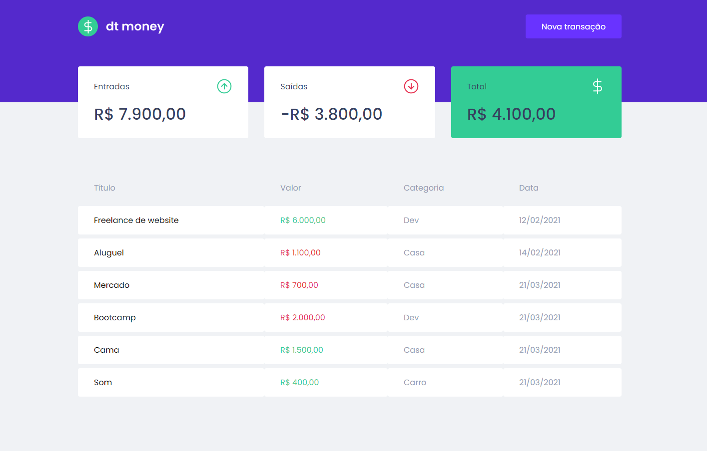

<h1 align="center">
  
</h1>

<p align="center">
  A personal finance tracking application built with ReactJS and TypeScript, developed during the Ignite ReactJS bootcamp by Rocketseat.
</p>

<p align="center">
  
  
  
</p>

<p align="center">
  
  
</p>

---

## Table of Contents

- [About](#about)
- [Features](#features)
- [Tech Stack](#tech-stack)
- [Project Structure](#project-structure)
- [Security Notes](#security-notes)
- [Getting Started](#getting-started)
- [Available Scripts](#available-scripts)
- [Layout](#layout)

---

## About

**dtmoney** is a financial control application that lets users register income and expense transactions and instantly see their balance summary. The app uses [MirageJS](https://miragejs.com/) to simulate a REST API entirely in the browser — no backend required to run the project.

Developed in Chapter II of the ReactJS track of the Rocketseat Ignite Bootcamp.

---

## Features

- Register new financial transactions (income or expense)
- View a summary card with total income, total expenses, and current balance
- List all transactions in a table with date, category, and amount
- Modal form for adding new transactions
- API fully mocked in the browser with MirageJS

---

## Tech Stack

| Technology | Purpose |
|---|---|
| [ReactJS 17](https://reactjs.org/) | UI library |
| [TypeScript](https://www.typescriptlang.org/) | Static typing |
| [Styled Components](https://styled-components.com/) | CSS-in-JS styling |
| [Context API + useContext](https://reactjs.org/docs/context.html) | Global state management |
| [MirageJS](https://miragejs.com/) | In-browser API mocking |
| [Axios](https://axios-http.com/) | HTTP client |
| [React Modal](https://reactcommunity.org/react-modal/) | Accessible modal dialogs |
| [Polished](https://polished.js.org/) | CSS helper functions (darken, transparentize) |

---

## Project Structure

```
src/
├── assets/              # SVG icons (income, outcome, total, logo, close)
├── components/
│   ├── Dashboard/       # Main content area (Summary + TransactionsTable)
│   ├── Header/          # Top bar with logo and "New Transaction" button
│   ├── NewTransactionModal/  # Form modal to create a transaction
│   ├── Summary/         # Balance cards (income / outcome / total)
│   └── TransactionsTable/   # Table listing all transactions
├── hooks/
│   └── useTransactions.tsx  # Context + custom hook for transaction state
├── services/
│   └── api.ts           # Axios instance configuration
├── styles/
│   └── global.ts        # Global styled-components styles
├── App.tsx              # Root component; modal state and providers
└── index.tsx            # Entry point; MirageJS server setup + ReactDOM.render
```

---

## Security Notes

This is a **learning/bootcamp project** — it intentionally has no backend, no authentication, and uses an in-browser mock API. The following points are worth noting if you plan to extend it toward production:

- **No authentication or authorization**: all transactions are visible to anyone with access to the app.
- **Hardcoded API base URL** in `src/services/api.ts`: in a real project, this should come from an environment variable (`REACT_APP_API_BASE_URL`).
- **No error handling** on API calls: failures are silently swallowed. Add `.catch()` handlers or `try/catch` blocks for production use.
- **No input validation** in the transaction form: add client-side validation before submission.
- **Outdated dependencies**: React 17 and `react-scripts` 4 are no longer the current versions. Consider upgrading to React 18 and Vite for new projects.
- **Positive**: TypeScript strict mode is enabled, no secrets are committed to the repository, and `.gitignore` correctly excludes `.env` files.

---

## Getting Started

### Prerequisites

- [Node.js](https://nodejs.org/) >= 14.x
- [Yarn](https://yarnpkg.com/) (recommended) or npm

### Installation

```bash
# Clone the repository
git clone https://github.com/FelipeBrenner/ignite-reactjs-dtmoney.git

# Enter the project directory
cd ignite-reactjs-dtmoney

# Install dependencies
yarn install
# or
npm install
```

### Running the app

```bash
yarn start
# or
npm start
```

Open [http://localhost:3000](http://localhost:3000) in your browser.

> The app uses **MirageJS** to intercept all HTTP requests and simulate the API entirely in the browser. No backend server or `.env` file is needed to run the project.

---

## Available Scripts

| Script | Description |
|---|---|
| `yarn start` | Runs the app in development mode at `localhost:3000` |
| `yarn build` | Builds the app for production into the `/build` folder |
| `yarn test` | Runs the test suite in interactive watch mode |
| `yarn eject` | Ejects from Create React App (irreversible) |

---

## Layout

The UI design is available on Figma:
[dtmoney — Figma](https://www.figma.com/file/0xmu9mj2TJYoIOubBFWsk5/dtmoney-Ignite-(Copy)?node-id=0%3A1)

> A Figma account is required to access the file.

---

Made by [Felipe Brenner](https://github.com/FelipeBrenner)
